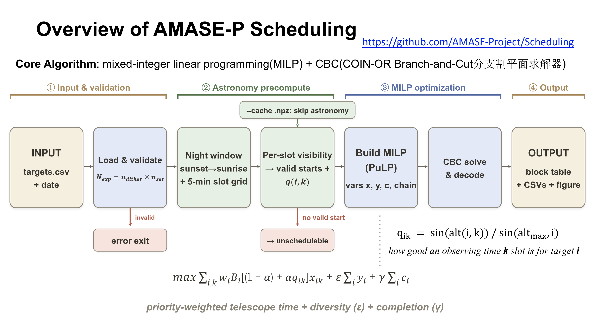

# AMASE-P Scheduling — User Manual

Observation scheduling software for the AMASE-P optical telescope at the
Nanshan Observatory, Xinjiang (87.175°E, 43.472°N, 2080 m). Given a
target list and a date or date range, it produces **priority-weighted
optimal** observing plans with mixed-integer linear programming
(MILP, PuLP + CBC) — from single-night scheduling to multi-night
campaign simulation with a weather model.



---

## 1. Installation

```bash
cd AMASE_scheduling
pip install -e .

# with the test suite:
pip install -e ".[dev]"
pytest
```

This installs four commands:

| Command | Purpose |
|---------|---------|
| `amase-schedule` | Observation scheduling (single night / multi-night campaign), writes CSVs |
| `amase-precompute` | Parallel visibility precomputation; writes a cache file reusable by `amase-schedule` |
| `amase-plot` | Renders figures from the CSV products of `amase-schedule` (plotting fully decoupled from scheduling) |
| `amase-web` | Local web UI: upload a target list, schedule with live progress, download results |

Dependencies: Python ≥ 3.10, astropy, astroplan, numpy, pulp[cbc] (CBC),
matplotlib, fastapi + uvicorn (web UI).

---

## 2. Repository layout

```
AMASE_scheduling/
├── pyproject.toml                # package metadata + CLI entry points
├── README.md                     # this manual
├── DESIGN.md                     # algorithm & architecture design document
├── CHANGELOG.md                  # release history
├── LICENSE                       # MIT
├── src/
│   └── amase_scheduling/
│       ├── observatory.py        # Nanshan site parameters, night window
│       ├── constraints.py        # constraint constants & checkers (alt/Sun/Moon)
│       ├── visibility.py         # slot grid, per-slot visibility, valid starts, quality
│       ├── target.py             # Target dataclass, strict CSV loading & validation
│       ├── milp.py               # MILP model build & CBC solve (PuLP)
│       ├── cache.py              # parallel visibility precompute + .npz cache
│       ├── scheduler.py          # unified scheduling engine + dataclasses
│       ├── weather.py            # Bernoulli clear-night model (seeded)
│       ├── output.py             # unified console report, CSV trio, CSV reloading
│       ├── plotting.py           # night / campaign / track figures
│       ├── cli.py                # amase-schedule
│       ├── cli_precompute.py     # amase-precompute
│       ├── cli_plot.py           # amase-plot
│       └── web/                  # amase-web: FastAPI backend + static frontend
├── tests/                        # pytest smoke tests (loader / scheduler / CSV round-trip / web API)
└── example/
    ├── targets.csv               # example 42-target list (grouped)
    ├── vis_cache.npz             # shipped visibility cache: 2027-04-01 .. 2029-04-01 for targets.csv
    ├── flowchart.png             # pipeline overview figure (shown above)
    ├── demo.py                   # end-to-end API walkthrough (script)
    ├── demo.ipynb                # the same walkthrough as a Jupyter notebook
    └── outputs/                  # created by the demos at runtime
```

---

## 3. Quick start

```bash
# ① How would tonight be scheduled? (prints the plan to the console)
amase-schedule example/targets.csv 2027-04-01

# ② Same night, save CSVs (also writes plan_targets.csv / plan_nights.csv), then plot
amase-schedule example/targets.csv 2027-04-01 -o plan.csv
amase-plot night plan.csv --date 2027-04-01 --targets example/targets.csv -o night.png

# ③ Half-month campaign (50% clear-night weather model + report + figure),
#    reusing the shipped visibility cache (covers 2027-04-01 .. 2029-04-01)
amase-schedule example/targets.csv --start 2027-04-01 --end 2027-04-15 \
    --clear-prob 0.5 --seed 42 --cache example/vis_cache.npz -o campaign.csv
amase-plot campaign campaign.csv --targets example/targets.csv -o campaign.png
```

---

## 4. Target list format

CSV table with the following columns (names are case-insensitive); all
are required except `group`:

| Column | Type | Description |
|--------|------|-------------|
| `name` | string | Target name |
| `ra` | deg / sexagesimal | Right ascension. Accepts `109.62`, `06h31m50.0s`, `6:31:50` |
| `dec` | deg / sexagesimal | Declination. Accepts `-13.22`, `+04d59m54s` |
| `priority` | float | Priority **weight** — larger wins. If your catalog uses rank semantics (1 = highest), invert it to weights with `--invert-priority` |
| `exp_time` | float (s) | Single exposure time in seconds, **≤ 3600 s** |
| `n_dither` | int | Dither count per set, **must be 1 / 3 / 9 / 27** |
| `n_set` | int | Number of dither sets (**season-total demand**, accumulated across nights), **≥ 1** |
| `group` | string | Target group (used for plot coloring / statistics). **Optional: a missing column or empty cell becomes `Untitle`** |

**Input validation**: any missing column or empty cell other than `group`
is an error naming the row and field; `ra`/`dec` accept only the two
forms above (fractional-minute spellings such as `05h40.9m0.0s` are
normalized by carrying into seconds); out-of-range `exp_time`,
`n_dither`, `n_set` are likewise rejected.

**Schedulable unit** = one exposure of `exp_time` seconds — dither sets
are *not* kept contiguous; the season demand is `n_dither × n_set`
independent exposures, schedulable at any time on any night. In
multi-night runs each scheduled exposure decrements the remaining count;
a target that reaches zero graduates and no longer occupies nights.

Example (`example/targets.csv`):

```csv
name,ra,dec,priority,exp_time,n_dither,n_set,group
NGC4258,184.739583,47.303972,1,3600,9,1,Zongnan Li
Rosette nebula,06h31m50.0s,+04d59m54s,1,720,9,6,Xihan Ji
IC434,05h40.9m0.0s,-01d30m00s,1,150,9,72,TK
```

**Default observing constraints**: target altitude > 30°; Sun altitude
< −12°; if Moon illumination ≥ 0.25, require Moon–target separation
> 30° (automatically satisfied while the Moon is below the horizon);
10 minutes of overhead per target switch.

---

## 5. `amase-schedule` reference

### 5.1 Selecting the date(s) (choose one)

```bash
amase-schedule targets.csv 2027-04-01              # positional: single night
amase-schedule targets.csv --date 2027-04-01       # equivalent
amase-schedule targets.csv --start 2027-04-01 --end 2027-04-15   # date range
amase-schedule targets.csv --start 2027-04-01      # --end omitted = single night
```

### 5.2 Options

| Option | Default | Description |
|--------|---------|-------------|
| `--clear-prob P` | 1.0 | Probability that a night is fully clear (0–1). 1.0 = no weather loss; 0.5 is typical for simulations |
| `--invert-priority` | off | Use when the list's priority is a rank (1 = highest): invert to weights (1 → highest weight) |
| `--seed N` | random | Weather RNG seed. **Identical seed ⇒ fully reproducible results** |
| `--eps X` | 0.001 | Diversity bonus weight. On ties, prefer covering more distinct targets |
| `--gamma X` | 0.01 | Completion bonus weight. Encourages finishing all of a target's remaining exposures within one night |
| `--alpha X` | 0.5 | **Transit-preference strength** (0–1). 0 = time-blind; larger values push blocks towards transit |
| `--time-limit S` | 60 | MILP solver time limit per night (seconds) |
| `--cache FILE` | none | Load a visibility cache (`.npz`) produced by `amase-precompute`, skipping repeated astronomy calculations |
| `-o, --output FILE` | none | Write the schedule CSV, plus `<stem>_targets.csv` (progress summary) and `<stem>_nights.csv` (nightly index: clear flag + sunset/sunrise window + Sun < −12° dark-window bounds) |
| `-v, --verbose` | off | Print per-night progress |

### 5.3 Output content

**Console**: a unified campaign report (a single night is a 1-night
campaign): night section (single night → full block table; multi-night →
compact per-night summary) → target completion table → totals
(clear nights, completed/partial/untouched targets, exposures, total
observing time).

**Blocks CSV columns**: `date, target, exposure, obs_start_utc, obs_end_utc,
obs_start_local, obs_end_local, lst_start, lst_end, duration_min, altitude_deg,
azimuth_deg, moon_sep_deg` (local = UTC+8; LST = apparent local sidereal time,
HH:MM mod 24).

**`<stem>_targets.csv` columns**: `target, required, done, fraction,
nights_observed, obs_hours`.

**`<stem>_nights.csv` columns**: `date, clear, night_start_utc,
night_end_utc, dark_start_utc, dark_end_utc, n_blocks, n_targets,
obs_hours, n_unschedulable` (window columns are physical and filled for
cloudy nights too).

---

## 6. `amase-plot` reference

Plotting is fully independent of scheduling: the inputs are the CSV trio
written by `amase-schedule -o` plus the original target list (which
provides coordinates and groups). `<stem>_targets.csv` and
`<stem>_nights.csv` are located automatically by naming convention, or
given explicitly via `--targets-csv` / `--nights-csv`. Re-plotting never
re-runs the scheduler.

```bash
# Two-panel campaign figure (needs schedule.csv + schedule_targets.csv + schedule_nights.csv)
amase-plot campaign schedule.csv --targets targets.csv -o campaign.png

# Two-panel figure for one night (altitude tracks + Gantt)
amase-plot night schedule.csv --date 2027-04-02 --targets targets.csv -o night.png

# Batch-export night figures for every night with observations
amase-plot nights schedule.csv --targets targets.csv -o duty_roster/

# Single-target observability diagnostic (no schedule products needed):
# altitude curve + Moon-separation curve (green = Moon-constraint-passing intervals)
amase-plot track --ra 184.7396 --dec 47.3040 --date 2028-02-09 -o track.png
amase-plot track --name NGC4258 --targets targets.csv --date 2028-02-09 -o track.png
# The site defaults to Nanshan; use --lon/--lat/--height for other locations
```

**Figure content**:
- **Night figure**: top = altitude tracks (scheduled blocks bolded,
  30° limit line, twilight shading); bottom = Gantt timeline. The time
  axis is Nanshan local time (UTC+8), with LST on the secondary axis.
- **Campaign figure**: top = night-window utilization (x = date, y =
  local time UTC+8; gray band = sunset→sunrise, dashed = −12°
  dark-window bounds, blocks colored by group, cloudy nights left
  blank); bottom = completion bars (≤ 40 targets: per-target bars
  clustered by group; > 40 targets: one aggregated bar per group).
- **Track figure**: top = target and Moon altitude curves (30° limit,
  twilight shading); bottom = Moon–target separation (30° threshold,
  green = intervals where the Moon constraint passes); the title shows
  the night's Moon illumination. The console also prints a one-line
  summary (max altitude / hours above 30° / min Moon separation /
  illumination).

---

## 7. `amase-precompute` reference

Visibility calculation (ephemerides, altitudes, the Moon) is the only
expensive step of the pipeline. For long date ranges, precompute it in
parallel once and reuse the cache across any number of scheduling runs
with different seeds or tuning parameters.

**The repo ships `example/vis_cache.npz`**: 732 nights
(2027-04-01 .. 2029-04-01) for `example/targets.csv`. Any schedule fully
inside that range can use it directly with `--cache example/vis_cache.npz`
— no precompute needed. You only need this section when you change the
target list or schedule outside the covered range.

```bash
amase-precompute targets.csv --start 2027-04-01 --end 2027-04-15 \
    --workers 8 -o vis_cache.npz

# Then pass --cache to every scheduling run:
amase-schedule targets.csv --start 2027-04-01 --end 2027-04-15 \
    --clear-prob 0.5 --seed 1 --cache vis_cache.npz
amase-schedule targets.csv --start 2027-04-01 --end 2027-04-15 \
    --clear-prob 0.5 --seed 2 --cache vis_cache.npz    # same cache, reused freely
```

| Option | Default | Description |
|--------|---------|-------------|
| `--start` | required | Start date |
| `--end` | required | End date |
| `--workers N` | 1 | Parallel worker processes (suggested = CPU cores) |
| `-o, --output` | required | Cache output file (`.npz`) |

**Cache invalidation**: a cache is bound to the target list (names +
order) and the date range. If the list changes or the requested dates
fall outside the range, scheduling stops with a clear error asking for a
fresh precompute.

---

## 8. `amase-web` reference

A local web UI (FastAPI + static frontend) wrapping the same scheduling
engine:

```bash
amase-web                      # serves http://127.0.0.1:8765 and opens your browser
amase-web --port 9000 --no-browser
```

| Option | Default | Description |
|--------|---------|-------------|
| `--host` | 127.0.0.1 | Bind address |
| `--port` | 8765 | Port |
| `--no-browser` | off | Do not open the browser automatically |

In the page: upload a target CSV (validated with the same rules as the
CLI, errors point at the offending row/field), pick a single night or a
date range plus weather/seed/tuning parameters, and start the job — a
live progress bar shows night-by-night advancement. When finished,
download the CSV trio and view the per-night altitude/Gantt figures in
the browser. The Exit button in the page shuts the server down.

To skip the on-the-fly visibility computation, load a precomputed
`.npz` cache (from `amase-precompute`, e.g. the shipped
`example/vis_cache.npz`) in the *Visibility cache* card: choose or
drag-and-drop the file (uploaded to the in-memory server), or enter a
server-side path and click Load. The UI shows the cache coverage,
limits the date pickers to it, and warns when the cache's target list
(names and exposure times) does not match the current targets.
Uploaded caches live in server memory — re-upload after a restart.

---

## 9. Recipes

```bash
# 1. On duty tonight — quick plan + figure
amase-schedule example/targets.csv 2027-04-01 -o tonight.csv
amase-plot night tonight.csv --date 2027-04-01 --targets example/targets.csv -o tonight.png

# 1b. Rank-style catalog (priority 1 = highest) — don't forget the invert switch
amase-schedule my_rank_catalog.csv 2027-04-01 --invert-priority -o tonight.csv

# 2. How much of the list can one month finish? (with weather)
amase-schedule example/targets.csv --start 2027-04-01 --end 2027-04-30 \
    --clear-prob 0.5 --seed 42 -o apr.csv
amase-plot campaign apr.csv --targets example/targets.csv -o apr.png

# 3. Full-season simulation (precompute first — finishes in minutes)
amase-precompute example/targets.csv --start 2027-01-01 --end 2027-06-30 \
    --workers 16 -o vis_h1.npz
amase-schedule example/targets.csv --start 2027-01-01 --end 2027-06-30 \
    --clear-prob 0.5 --seed 42 --cache vis_h1.npz -o h1.csv
amase-plot campaign h1.csv --targets example/targets.csv -o h1.png

# 4. Compare completion rates under different weather luck (same cache, vary the seed)
for s in 1 2 3 4 5; do
  amase-schedule example/targets.csv --start 2027-04-01 --end 2027-04-30 \
      --clear-prob 0.5 --seed $s --cache vis_cache.npz -o sim_s$s.csv
done

# 5. Fill the night regardless of when targets are observed (disable transit preference)
amase-schedule example/targets.csv 2027-04-01 --alpha 0

# 6. Export duty figures for every clear night
amase-schedule example/targets.csv --start 2027-04-01 --end 2027-04-15 \
    --clear-prob 0.5 --seed 42 -o apr.csv
amase-plot nights apr.csv --targets example/targets.csv -o duty_roster/
```

---

## 10. Tuning the three bonus weights

| Symptom | Adjustment |
|---------|-----------|
| Blocks land far from transit, altitudes low | Increase `--alpha` (e.g. 0.7) |
| High-priority targets crowd out everything, low coverage | Determined by the priority gap itself — tuning helps little; consider narrowing the gap |
| Many targets left 8/9 done ("almost finished") | Increase `--gamma` (e.g. 0.05) |
| Same target scheduled again and again among equals | Increase `--eps` (e.g. 0.01) |
| Solver timeouts (very large target list) | Increase `--time-limit`, or speed up with `amase-precompute` |

Principle: the main term (priority × duration) always dominates; the
three parameters only fine-tune near-ties.

---

## 11. FAQ

**Q: Why was my target never scheduled all night?**
A: Check which list it appears on in the report: *unschedulable*
(geometrically impossible that night — altitude too low / transit in
daylight / Moon blocking) or *unselected* (visible but outcompeted by
higher-value work). The `amase-plot night` track figure shows the
reason at a glance; `amase-plot track` diagnoses a single target.

**Q: Why did a target finish only part of its `n_set`?**
A: `n_set × n_dither` is the season-total exposure demand. Nights too
short to fit an exposure, weather losses, or competition from
higher-value targets all leave exposures unscheduled. The campaign
report's completion column shows the fraction.

**Q: Are results fully reproducible?**
A: Yes. Same target list + same `--seed` + same parameters ⇒ identical
schedule, block for block. Without `--seed` the weather is random.

**Q: Does a single-night schedule need the weather model?**
A: Single nights default to `--clear-prob 1.0` (tonight you're really
observing — no dice rolled). Lower it explicitly only to simulate
"tonight might be cloudy".

**Q: Can far-southern targets (e.g. WR7/WR116 at Dec = −13°) be
scheduled at all?**
A: Yes, but only barely. From Nanshan at 43.5°N they culminate at
~34°, so the visible window is very narrow — but because the
schedulable unit is a single exposure, the optimizer can slip
individual exposures into that window and accumulate them across
nights (both complete in the example full-year campaign). If transit
falls in twilight or daylight for the whole season they remain
unschedulable; truly invisible targets like CentaurusA (Dec = −43°,
culmination ~3.5°) are honestly marked unschedulable rather than
forced in. Observe such targets in the season when they transit late
at night.

---

*For the algorithm and architecture see `DESIGN.md`; for a complete API
example see `example/demo.py`.*
